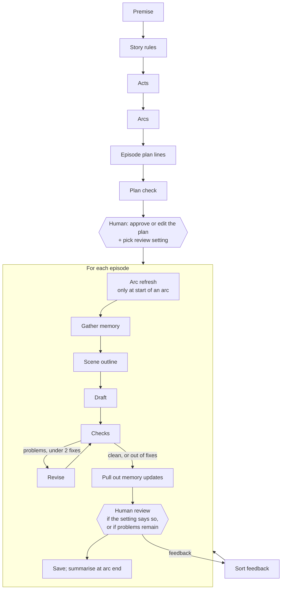

# Architecture

How the serial writer plans, writes, checks, remembers and takes direction from a
human, for a 200-episode story on a 12B model.

The guiding idea: **the database is the story's memory, the model is just the writer.**
Everything the story "knows" lives in tables. Each model call is small, focused, and
gets only the slice of memory it needs, picked by code.

The one rule nothing breaks: **the model proposes, code checks, the human approves
(when needed), and only then does it go in the database.** The model never changes
the story's memory directly.

---

## 1. The model we're designing for

Measured against the live server (`surya2` = Gemma 4 12B, 4-bit, vLLM 0.29):

| | |
|---|---|
| Max context | 48,192 tokens |
| Parallel requests | 5 |
| Writing speed | ~76 tokens/s per request |
| One 575-word episode | ~10 s |
| JSON with a fixed schema | works reliably |

What this means for the design:

- **Small model → small jobs.** One call drafts, a different call checks, another
  pulls out facts. A 12B model does each of these well on its own and poorly all at once.
- **Short prompts beat long ones.** The model *can* read 48k tokens, but accuracy drops
  well before that. We aim for **~12k tokens per call**, never more than ~20k.
- **Never trust a claim without proof.** In the first test episode the model said the
  victims died in a *gas explosion*, then a few paragraphs later a ghost mentions
  *"since the fire."* So every checker and every memory update must quote the exact
  words it's based on, and code confirms those words really appear in the text.
- **5 parallel slots** let us run the separate checks at the same time.

---

## 2. The big picture

Two human stops are built in: **the plan**, and **episodes** (as often as the reviewer
chooses). A third kicks in automatically: **anything the checks couldn't fix.**

---

## 3. Planning (once, before writing)

Built top-down, one level at a time. That way each call is small, and the human can
fix a level before the levels under it get built on top of a mistake.

| Step | Output | Calls |
|---|---|---|
| **Story rules** | Title, tone, style guide, world rules, main cast (who they are, what they want, their secret), and **the hidden truth** of the mystery | 1 |
| **Acts** | 5 acts (~40 episodes each): goal, the turning point that ends it, where each main character is by the end | 1 |
| **Arcs** | 20 arcs (~10 episodes each), made one act at a time | 5 |
| **Episode plan lines** | One line per episode: what must happen, who's in it, which threads open, move or close. Made one arc at a time, each seeing the arc before it | 20 |
| **Plan check** | See below | code + 5 |

**The hidden truth** matters most for this kind of story. A mystery that runs 200
episodes needs a fixed answer from day one, or clues end up contradicting each other.
The model sees it every time it writes, and readers only learn it when the plan reveals it.

**Plan check:**
- **Code checks:** all 200 episodes are covered with no gaps or overlaps. Every name
  in a plan line is in the cast. Every thread that opens has a planned close (or is
  marked as left open on purpose). Turning points sit at the act boundaries.
- **Model check, one act at a time:** repeated beats, sagging stretches, characters
  who disappear for too long.
- Problems are shown to the human next to the plan. Nothing is silently "fixed."

**Human review of the plan:** approve it, edit any line at any level, or ask for a
level to be redone with a note. Editing an act or arc offers to rebuild the plan lines
under it. Every change makes a new plan version with the reason saved.

The plan also gives us **planned threads**: each one with the episode it's meant to
open and close. While writing, code compares where a thread *is* with where it's
*meant to be*, and flags threads that are overdue or have been forgotten.

---

## 4. Writing one episode

### 4.1 Arc refresh (start of each arc only)

Plans go stale. By episode 80, the human has given feedback and the story has drifted
a little. So before each new arc, one call re-reads the arc's 10 plan lines against
**what actually happened**, the current character states and the active instructions,
and suggests updates. This is the main way feedback reaches the *plan*, not just the
next episode. Changes become a new plan version. If the review setting includes arc
ends, the human sees the changes before writing continues.

### 4.2 Gather memory (code only, no model)

Code builds a fixed-size "memory pack" for the episode. **Its size is about the same
at episode 5 and episode 150.** That's what keeps quality steady.

| Layer | What's in it | ~Tokens |
|---|---|---|
| **1. Rules** | Style guide, world rules, the hidden truth, **all active human instructions** | 1.5k |
| **2. Plan** | Current act and arc goals, this episode's plan line, the 2 before and 3 after | 1k |
| **3. Summaries** | Story so far (short), current act, latest arc. Each has the fixed sections: what happened, main characters, timeline, open threads with age, main storylines and key lines, human review points | 3k |
| **4. Recent** | Last episode in full, one-liners for the 5 before it | 1.5k |
| **5. Who and what's in this episode** | For each character in the plan line: alive or dead, where they are, what they know, relationships. For each thread: its history. Plus any overdue threads | 2k |
| **6. Looked up** | Older facts, key lines and past episode one-liners about *these* characters and threads, found by name and by keyword search | 2k |

**Order matters for speed.** Things that rarely change (rules, act plan) go first, so
vLLM can reuse its work from the last call (prefix caching). Things that change every
episode go last.

**Traceable:** each pack is saved with the episode, so we can always answer "what did
the model know when it wrote episode 150?"

**Looking things up without an embedding model:** the plan line names the characters
and threads involved, so we fetch exactly those records. That's more precise than
similarity search. SQLite's built-in keyword search (FTS5) covers the rest, e.g. a
plan line that mentions "the ledger" finds older facts about the ledger.

### 4.3 Scene outline, then draft

- **Scene outline** (JSON): 3–5 scenes, who's in each, what changes, the closing hook,
  and which memory items it relies on. A cheap step that makes the draft much more
  focused.
- **Draft** (free text, temperature ~0.8): written from the outline and the memory
  pack, with the style guide: plain spoken English, short sentences, lots of dialogue,
  people who talk like people.

### 4.4 Checks

**Code checks (instant, free):**
- Length is 400–700 words.
- AI-cliché list ("a chill that had nothing to do with", "couldn't help but",
  "little did they know", "testament to"…) above a threshold.
- A character marked dead speaks or acts (not just "is mentioned").
- Format (title line, no meta-commentary like "In this episode…").

**Model checks, 3 focused calls run in parallel:**

| Checker | Compares the draft with | Catches |
|---|---|---|
| **Continuity** | Character states, facts, last episode | Contradictions: gas vs fire, wrong location, someone knowing what they shouldn't |
| **Plan and instructions** | This plan line, active instructions | Plan line not delivered, an instruction ignored, weak or missing hook |
| **Repetition** | One-liners of past episodes with the same characters and threads | The same beat played again: another near-miss, another identical reveal |

Every reported problem must include **the exact words from the draft** and, for
continuity, **which stored fact it clashes with**. Code checks that the quote really is
in the draft. Problems with made-up quotes are dropped and logged. This stops the
checker from inventing problems, a common failure with small models.

Problems are either **must-fix** (continuity breaks, plan line missed, instruction
ignored) or **minor** (shown to the human, never blocks).

### 4.5 Revise (2 rounds at most)

If there are must-fix problems, one call rewrites the episode with the problem list,
asked to change only what's needed. Then the checks run again. After 2 revisions,
whatever is left is marked and the episode **goes to the human no matter what the
review setting is.**

### 4.6 Pull out memory updates

One call reads the final draft and returns, as JSON:
- A one-line "what happened" and a ~100-word summary.
- Character changes: status, location, what they now know, relationship changes.
- New facts and timeline (story day and time).
- Thread events: opened, moved forward, resolved.
- Key lines: exact quotes of promises, threats and reveals.
- New characters.

Two safeguards, because these updates become the story's memory:
1. **Fixed lists:** character and thread names in the JSON can only be names that
   already exist (or go in a separate "new character" list). The model can't misspell
   someone into a duplicate.
2. **Proof:** every change carries its quote from the episode, and code checks it.

The updates are saved **tied to this draft** and only become real memory when the
episode is approved (the `live_*` views in the schema do this). So the reviewer sees
exactly what the system is about to remember, e.g. *"Meena: alive → dead"*, and can
catch a bad update before it spreads.

### 4.7 Human review

When the review setting says so, or problems remain, the reviewer sees the episode,
the check results, the proposed memory updates and the plan line. Then:

- **Approve:** the episode and its memory updates go live.
- **Edit:** the human's text becomes a new version. Memory is pulled out again from the
  edited text, then it's approved.
- **Reject with a reason:** the episode is written again, with the reason as a must-fix
  note.
- **Give feedback:** see section 5.

**Review settings** (picked when the story is created, changeable any time, history
kept): every episode / every N episodes / only when problems are found / at the end of
each arc. Episodes with unresolved problems always stop for review.

### 4.8 Save and summarise

On approval: the episode goes live and the thread ages update. At the end of each arc,
an arc summary is made, then an act summary at the end of each act, and the
story-so-far is rebuilt.

- The **"what happened"** part of each summary is written by the model, from the
  episode summaries.
- The **sections**, meaning main characters, timeline, open threads and their age, main
  storylines, key lines and human review points, are **filled by code straight from the
  tables**. A summary of a summary of a summary can't slowly drift away from the truth.

---

## 5. Feedback that carries forward

Free-text feedback like *"slow down the romance"* or *"kill off Arjun"* is first sorted
by the model, then **the human confirms the sorting with one click** (a wrong guess
here would quietly send the story the wrong way):

| Kind | Example | What happens |
|---|---|---|
| **Fix this episode** | "The dialogue in scene 2 is stiff" | Rewrite this episode only |
| **Lasting instruction** | "Slow down the romance" | Saved permanently; in every future memory pack (layer 1); the plan checker enforces it; arc refresh plans around it |
| **Story change** | "Kill off Arjun" | Plan change: the current arc's remaining plan lines are redone around it, and later plan lines that use Arjun are marked to be fixed at their arc refresh. The human approves the new plan lines |

**Nothing is ever lost.** Feedback and instructions can't be edited or deleted (the
database itself refuses). An instruction's status (active / paused / done / replaced)
changes by adding a new row, so the full history is always there. Each summary's
"human review points" section lists what was said, so even old feedback stays in view.

---

## 6. LangGraph: how the steps are wired

**One graph per story, with the story's id as the LangGraph thread id.** The graph has
a planning part and an episode loop. Human stops use LangGraph's `interrupt()`, and
the web app resumes the graph with the human's decision.

**Human stops are `interrupt()` calls, each in its own node that does nothing else.**
When LangGraph resumes, it re-runs the interrupted node from the top, so any work
before the interrupt would happen twice. The human's answer is applied in the next
node. If the answer can't be applied (e.g. an edit names a character who doesn't
exist), the graph goes back to the same stop with the error shown, and nothing is
written.

**Every step only fills in what's missing.** The planning steps check which acts,
arcs and plan lines already exist in the current plan version and only make the
rest. That one rule covers three needs: resume after a crash without redoing work,
"redo just arc 7" (copy the plan without arc 7's lines, and the step rebuilds only
those), and building in order.

**Two places that store things, on purpose:**
- **`checkpoints.db`** (LangGraph's SqliteSaver): where the graph is paused. Kept
  separate so the graph's frequent writes don't fight the web app's reads.
- **`story.db`**: the story itself. The graph's own state is kept tiny (story id,
  episode number, version id, revision count). All real content is in `story.db`, so
  the web app can show and edit it directly.

**Resume ("stop after 12, come back later"):** the graph picks up at its last
checkpoint. Every step is written to be safe to re-run: before doing work, it checks
whether its result already exists for this episode version. So a crash or restart
mid-episode never creates duplicates or loses work.

---

## 7. Limits and stopping rules

| Limit | Value | When hit |
|---|---|---|
| Revisions per episode | 2 | Send to human with the remaining problems |
| Attempts per model call | 3 (retry on server errors, cut-off replies, bad JSON) | Episode paused, error logged |
| Token budget per episode | 150k (normal use ~80k) | Stop, send to human |
| Max output per call | Set per step (draft 1.5k, extraction 2k…) | Counts as a failed attempt |
| Run target | "Write up to episode N" | Stop cleanly |
| Failed episodes in a row | 2 | Pause the story and show the error |

---

## 8. What gets logged

Every model call: step name, episode, attempt number, tokens in and out, time taken,
finish reason, errors, and the full prompt and reply. Every decision (revise, send to
human, retry, stop on budget) is a row in `steps`. The web app shows tokens and time
per episode and per step.

**Rough estimate (to be replaced with real numbers once running):**
~7 calls per episode, ~12k tokens in and ~1k out each → **~85k tokens and ~60–90 s
per episode**, so **~17M tokens and ~4–5 hours for 200 episodes.** Ways to cut it
(after accuracy is solid): run checks only on what changed after a revision, merge
the scene outline into the draft call, shorter memory packs for quiet episodes, and
batch arc-level work.

---

## 9. Web app

FastAPI + HTMX pages, no front-end build step. Writing runs in a background worker
(one per story) so pages stay quick. Pages poll for progress.

| Page | What you can do |
|---|---|
| New story | Enter premise, pick review setting |
| Plan | See acts, arcs, plan lines and plan-check problems; edit, redo with a note, approve |
| Episode review | Read the episode, problems found, proposed memory updates; approve, edit, reject, give feedback |
| Story memory | Characters, threads (with age), facts, instructions and their history |
| Run log | Calls, tokens, time, retries, decisions, per episode |
| Controls | Write up to episode N, pause, change review setting |

---

## 10. Changing history: "a human rewrites episode 40" (proposal, to discuss)

Every episode saves its memory pack, including **the ids of every memory row it was
given** (facts, character states, thread events, key lines). That's a dependency
record: which earlier facts each episode was built on.

When episode 40 gets a new version:
1. Memory is pulled out again from the new text and compared with the old version's
   memory: what was removed, what changed, what's new.
2. Old-version memory drops out on its own (it points at a version that's no longer
   approved); nothing is deleted.
3. Episodes 41+ whose packs used a removed or changed row, or that involve the same
   characters and threads, are marked **stale**. The rest stay as they are.
4. The human sees the stale list, with the reason for each, and chooses: keep, revise
   with a note, or rewrite from the first stale episode. The arc refresh re-plans
   the affected plan lines.

So a change only invalidates the episodes that actually depended on it, not
everything after episode 40.

---

## 11. Build order

1. ✅ Database, model client, logging
2. ✅ Planning steps + plan check + plan approval as a LangGraph interrupt
3. Plan review page (first human stop)
4. Memory pack builder
5. Episode writing: outline → draft → checks → revise
6. Memory updates + approval
7. Episode review page + feedback sorting
8. Summaries + arc refresh
9. Resume, run controls, logs page
10. Demo run (15+ episodes, 2+ feedback interventions) + DECISIONS.md

Each step comes with tests that use a fake model, plus one real run on the server.
